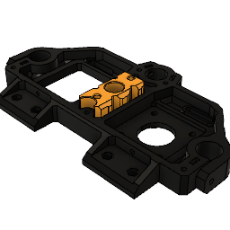
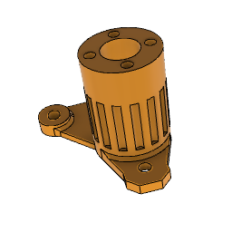
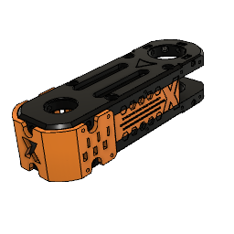
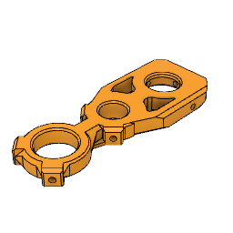
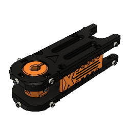
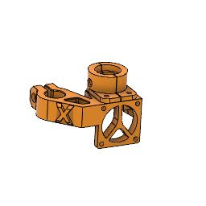
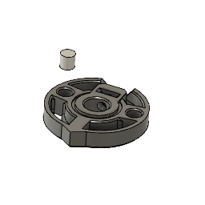
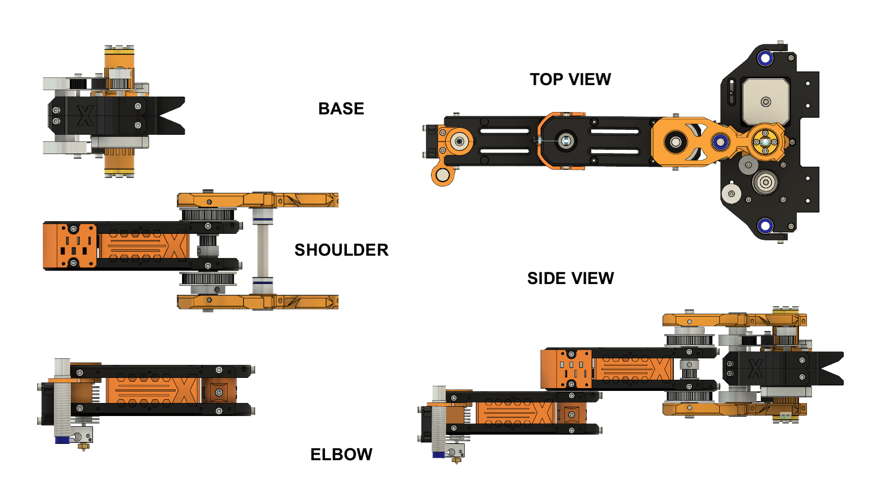

Bill of materials
===

Rods
* 1 x 8 mm rod 80 mm length (or hollow axis)
* 1 x 8 mm rod 40 mm length (or hollow axis)
* 1 x 8 mm rod 60 mm length (or hollow axis)

Linear and radial bearings
* 4 x LM8UU linear bearings 
* 1 x LM8LUU linear bearing
* 6 x 623 radial bearings (OD/ID/T 10x3x4)
* 2 x 6002 radial bearings (OD/ID/T 32x15x9)
* 5 x 608 radial bearings (OD/ID/T 22x8x7)

Pulley and belts
* 3 x 280 mm 2GT closed belt
* 2 x 20 teeth 2GT inner bore 5 mm pulley (motor shaft) 
* 1 x 20 teeth 2GT inner bore 8 mm pulley
* 2 x 20 teeth 2GT inner bore 3 mm idler
* 2 x 20 teeth 2GT inner bore 3 mm idler without teeth
* 3 x 60 teeth 2GT inner bore 8 mm

Screws and nuts
* 2 x Tr8 Z-Nut (1 is mandatory, 2 are optional) 
* 70 x M3x10 mm socket head screw
* 20 x M3x12 nnm socket head screw
* 20 x M3x15 or M3x16 mm socket head screw
* 10 x M3x20 mm socket head screw
* 10 x M3x30 mm socket head screw
* 100 x M3 nuts (2mm thick)

Motors
* 2 x NEMA 17 motor 

Endstops
* 2 x Neodium 5x5 mm cylindrical magnets (for endstops)
* 2 x Hall-effect endstops

Printed parts
===

| Part                         | Count | Picture                                                             |
| ---------------------------- | ----- | :-----------------------------------------------------------------: |
| **BASE**                     |       |                                                                     |
| Arm_Base_MotorPlate          <td> 2<td rowspan=2>            |
| Arm_Base_ZPlate_Mid_NutHolder| 1     |                                                                     |
| Arm_Base_ZHub_Top            <td> 1  <td rowspan=2>                 |
| Arm_Base_ZHub_Bottom         | 1     |                                                                     |
| **SHOULDER**                 |       |                                                                     |
| Arm_Shoulder_Plate_Top       <td> 1<td rowspan=5>                     |
| Arm_Shoulder_Plate_Bottom    | 1     |                                                                     |
| Arm_SideWall_Left            | 1     |                                                                     |
| Arm_SideWall_Right           | 1     |                                                                     |
| Arm_Plates_Cover             | 2     |                                                                     |
| Arm_Shoulder_Connector       | 2     |                |
| **ELBOW**                    |       |                                                                     |
| Arm_Elbow_Plate_Top          <td> 1<td rowspan=5>                        |
| Arm_Elbow_Plate_Bottom       | 1     |                                                                     |
| Arm_Elbow_RodHub             | 1     |                                                                     |
| Arm_SideWall_Left            | 1     |                                                                     |
| Arm_SideWall_Right           | 1     |                                                                     |
| **E3D MOUNT**                |       |                                                                     |
| Arm_EMount_Base_ABL          <td> 1<td rowspan=3>                       |
| Arm_EMount_Base_Left         | 1     |                                                                     |
| Arm_EMount_Base_Right        | 1     |                                                                     |
| **ENDSTOPS**                 |       |                                                                     |
| Arm_Endstop                  | 2     |                             |

Assembly
===
 

The arm assembly can be split into five separate stages: 

1. Base assembly
2. Shoulder assembly
3. Elbow and extruder mount assembly
4. Connecting shoulder and base
5. Connecting the arm to X-SCARA frame 
6. Mount the endstops

