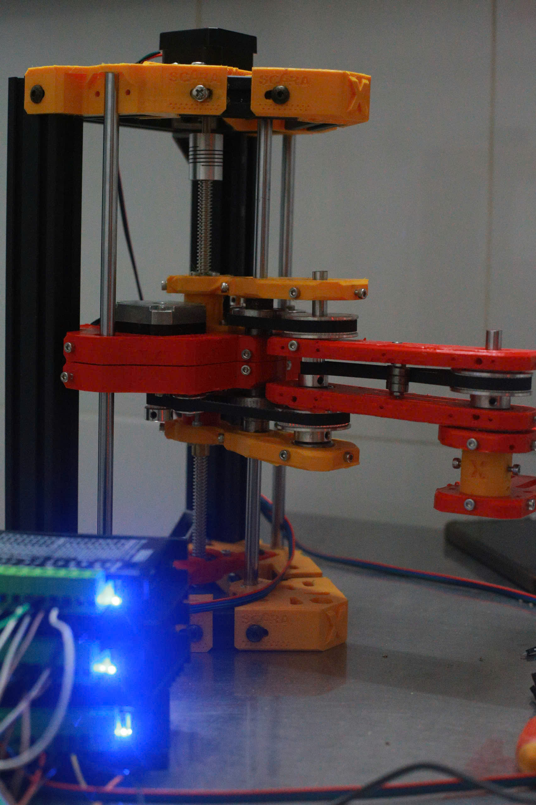

# Scara Robot projetc - Bridging Theory and Practice in Robotics

> *An undergraduate research project exploring the implementation of robotic theory through a functional SCARA robot prototype.*

## Demo

## 🎯 Project Objectives

This project aims to:

1. **Apply core robotics theories** such as forward/inverse kinematics to a real-world SCARA robot.

---

## HARDWARE:
  - Mechanical design  adapted from [X SCARA 3D printer robot project](https://github.com/madl3x/x-scara/tree/master/hardware)
  - Actuator: stepper motor
  - MCU: stm32f103c8t6
  - Driver motor: TB660
## FIRMWARE: 
  - **scara-robot**: The entire firmware for STM32F103C8T6 MCU
  - **Trapezoidal Velocity Profile**: Ensures smooth acceleration and deceleration during motion, minimizing mechanical stress and improving positional accuracy.
  >Note: Based on extensive trial runs, the following maximum pulse rates were determined:
**Rotational joints**: up to **5000 pulses/second**
**Prismatic joints**: up to **10000 pulses/second**
Exceeding these limits may cause the hardware to fail to respond in time, resulting in vibration or instability during motion. These thresholds were established through empirical testing to ensure safe and reliable operation.
- **Ring Buffer Integration**: Allows the robot to queue and execute subsequent commands even while the current operation is still in progress. This enables seamless multi-step tasks and improves responsiveness.
- **Real-Time Step Control**: Each motor is driven with precise timing to achieve accurate joint positioning.
- **Modular Design**: Firmware is structured to support future extensions such as PID tuning, sensor feedback, or multi-axis coordination.
## 🎮 Control Interface

Currently, the robot is controlled via UART commands sent directly to the firmware. Each joint (rotational/prismatic axis) can be commanded individually using the following syntax:

>SET,\<Joint Name>,\<Value>;
- `<Joint Name>`: One of `X`, `Y`, or `Z`(Prismatic joint) representing the joints.
- `<Angle/Distance>`: Target angle//distance for the joint to rotate/ to.

**Example**:
SET,X,45; SET,Y,-30; SET,Z,35.0;

## License & copyright
@ Hoang Huy Nguyen, Ho Chi Minh City University of Technology

Licensed under the [MIT license](LICENSE)

